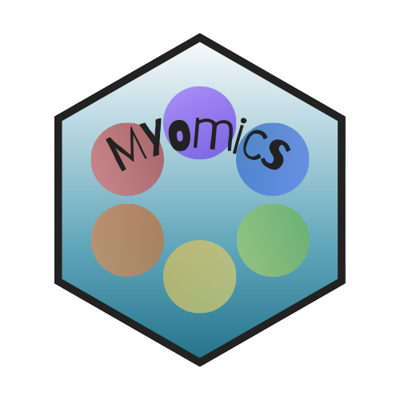

# MYomics 

_**MYomics**_: **MY** shiny app for **omics** data visualization and integration.

Formerly _**DPomics**_: **DP** lab **omics** visualization and integration.

 
---

 This work is licensed under a <a rel="license" href="http://creativecommons.org/licenses/by-nc-nd/4.0/">
Creative Commons Attribution-NonCommercial-NoDerivatives 4.0 International License</a>.

