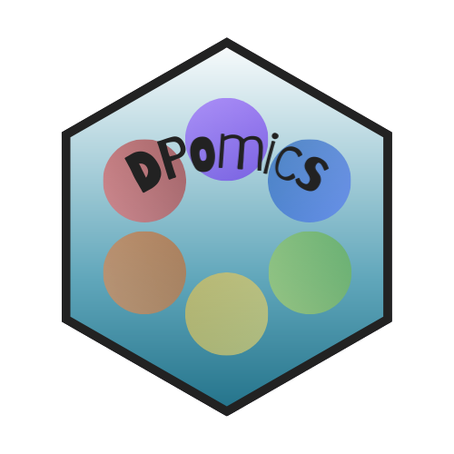

# Shiny DP 

_**DPomics**_: **DP** lab **omics** visualization and integration

## Goal

Shiny app to visualize RNAseq and ChIPseq data and integrate them. The data loaded here ouptus from the Snakemake RNAseq and ChIPseq pipelines from [dfernandezperez](https://github.com/dfernandezperez/), but it could be anything like:

* RNAseq input data is a data frame made from several DESeq2-like table with the following columns (several come directly from DESeq2):

Contrast | Geneid | log2FoldChange | padj | DEG | 
:------: | :----: | :------------: | :--: | :-: |
Extra column with the name of the contrasts where the gene in the corresponding row comes from | ID of the gene (i.e. Gene symbol) | log~2~(FC) | Adjusted p-value | Extra column with the differential expression of the corresponding genes, values are "Upregulated", "Downregulated", "NS".

* ChIPseq input data comes from `annotatePeak()` with all the conditions and has the following columns (several come directly from `annotatePeak()`):

seqnames | startnd | end | annotation | SYMBOL | distanceToTSS | condition |
:------: | :----: | :------------: | :--: | :-: | :-----------: | :------: |
Chromosome number (i.e. chr1) | Starting position of the peak | Ending position of the peak | Region where the peak is annotated (i.e. Distal intergenic) | Gene symbol or any identificator of the nearest gene (i.e. Lef1) | Distance to TSS of the nearest gene | Extra column with the condition of the corresponding peak.

## Instructions

## General information

### Contributors

**Developers**: [amitjavilaventura](https://github.com/amitjavilaventura/), [dfernandezperez](https://github.com/dfernandezperez/) and [ferossitiziano](https://github.com/ferossitiziano/)

### Dependencies

*DPomics* depends on several R packages:

* Shiny-realted packages

   + `shiny`
   + `DT`   

* To have tidy code

   + `tidyverse`
   + `magrittr`   

* To work with lists and granges

   + `plyranges`  

* To plot things

   + `VennDiagram`: to plot the Venn diagrams from the intersecting degs
   + `ComplexHeatmap`: to plot the log2FC heatmaps
   + `ChIPpeakAnno`: to plot the Venn diagrams of the overlapping ChIP peaks
   + `cowplot`
   + `ggpubr`
   + `circlize`   
   

## To do

* Include download options for lists and plots.
* Modify the pipelines to create the desired input (one rule).
* Modify chipseq input file to include more columns regarding the condition (implies modifying the pipeline):

  + Now includes `condition` which is formatted as `prot1_cond1`, `prot1_cond2`, with `prot` being the chipped protein and `cond` being the condition where the protein was chipped from...
  
  + Include, a part of the existing `condition`, a `protein` column with the name of the prot for each observation. This is to stablish a `facet_wrap()` in the ggplots so they will be preetier.
  
* Integrate RNAseq and ChIPseq data.
* Change the theme with `shinyThemes`.
* Make a Desktop app with `photon`.

## CRAZY ideas

* Allow more omics data, like ChIPs from histone modifications (i.e. H3K4me1, H3K4me3, H3K27me3, H3K27ac), so we will able to predict some enhancers.
* Integrate all the data with the preexisting one. It can be done in R, so it should not be difficult
  